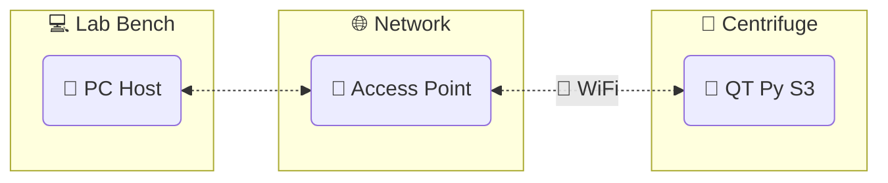

# QT Py S3 DAQ App

A data acquisition application using the [Adafruit QT Py S3](https://learn.adafruit.com/adafruit-qt-py-esp32-s3) and [CircuitPython](https://circuitpython.org/).

 

## Structure

- Host program: `qtpy_datalogger`
- QT Py program: `qtpy_sensor_node`

## Legacy system

[Summary and source code](./docs/legacy/README.md)
