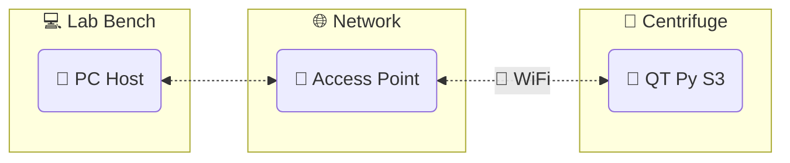

# QT Py S3 DAQ App

A data acquisition application using the [Adafruit QT Py S3] and [CircuitPython].

[![Run Tests and Analyzers]](https://github.com/wireddown/qt-py-s3-daq-app/actions/workflows/ci.yml?query=branch%3Amain) [![Dependabot Updates]](https://github.com/wireddown/qt-py-s3-daq-app/actions/workflows/dependabot/dependabot-updates)

## Structure

- Host program: `qtpy_datalogger`
- QT Py program: `qtpy_sensor_node`

## Questions and help

Please go to the [wiki home page] for guidance.

## Contributing

This project manages its Python programs with `poetry`.

The environment setup instructions are in the wiki on the [Contributing] page.

## Legacy system

This project replaces a legacy system that uses Python and JeeNodes.

See the [summary and source code] in the `docs/legacy` folder for details.

[Run Tests and Analyzers]: https://github.com/wireddown/qt-py-s3-daq-app/actions/workflows/ci.yml/badge.svg?branch=main&event=push
[Dependabot Updates]: https://github.com/wireddown/qt-py-s3-daq-app/actions/workflows/dependabot/dependabot-updates/badge.svg

[Adafruit QT Py S3]: https://learn.adafruit.com/adafruit-qt-py-esp32-s3
[CircuitPython]: https://circuitpython.org/

[wiki home page]: ../../wiki/Home
[Contributing]: ../../wiki/Contributing
[summary and source code]: ./docs/legacy/README.md
