# QT Py S3 DAQ App

A data acquisition application using the [Adafruit QT Py S3] and [CircuitPython].

[![Run Tests and Analyzers]](https://github.com/wireddown/qt-py-s3-daq-app/actions/workflows/ci.yml?query=branch%3Amain) [![Dependabot Updates]](https://github.com/wireddown/qt-py-s3-daq-app/actions/workflows/dependabot/dependabot-updates)

## Structure

```mermaid
graph LR
    AP(🛜 Access Point)
    App(🐍 App)
    MQTT(📨 MQTT)
    QTPy(🐍 QT Py S3)

    subgraph "🌐 Network"
        AP
    end

    subgraph "💻 PC Host"
        App<-.->MQTT
        MQTT<-.->AP
    end

    subgraph "🧪 Test Zone"
        AP<-.->|🛜 WiFi|QTPy
    end
```



Supported Python versions
- Host: **Python 3.11** and newer
- Node: **CircuitPython 9.0** and newer

Supported host platforms
- Windows

Supported connection types
- serial / UART
- network / MQTT

Entry points
- Host program: [`qtpy_datalogger/console.py`](./src/qtpy_datalogger/console.py)
- QT Py program: [`qtpy_sensor_node/sensor_node/code.py`](./src/qtpy_datalogger/sensor_node/code.py)

## Preview in 60 seconds

1. Download the most recent build artifact from `main`
   - https://github.com/wireddown/qt-py-s3-daq-app/actions?query=branch%3Amain
1. Connect your QT Py device with USB
1. Preview the program in a deletable Python virtual environment

```pwsh
# Create and enter a new Python virtual environment
mkdir qtpy-preview
cd qtpy-preview
python -m venv --upgrade-deps .venv
.\.venv\Scripts\activate.ps1

# Install a build artifact
# https://github.com/wireddown/qt-py-s3-daq-app/actions?query=branch%3Amain
pip install C:\Users\name\Downloads\qtpy_datalogger-0.1.0-py3-none-any.whl

# Show the package help
qtpy-datalogger --help

# Search for devices
qtpy-datalogger connect --discover-only

# Install the node runtime on a device
qtpy-datalogger equip

# Open a serial terminal session, use Ctrl-] to quit
qtpy-datalogger connect
```

This preview does not demonstrate MQTT communication over WiFi
 - Visit the wiki for [MQTT setup and commissioning] to exercise that capability


## Questions and help

Please go to the [wiki home page] for guidance.

## Contributing

This project manages its Python programs with `poetry`.

The environment setup instructions are in the wiki on the [Contributing] page.

The design documentation is in the wiki under the [Design Doc X] pages.

## Legacy system

This project replaces a legacy system that uses Python and JeeNodes.

See the [summary and source code] in the `docs/legacy` folder for details.


[Run Tests and Analyzers]: https://github.com/wireddown/qt-py-s3-daq-app/actions/workflows/ci.yml/badge.svg?branch=main&event=push
[Dependabot Updates]: https://github.com/wireddown/qt-py-s3-daq-app/actions/workflows/dependabot/dependabot-updates/badge.svg

[Adafruit QT Py S3]: https://learn.adafruit.com/adafruit-qt-py-esp32-s3
[CircuitPython]: https://circuitpython.org/

[MQTT setup and commissioning]: https://github.com/wireddown/qt-py-s3-daq-app/wiki/Walkthrough-5-MQTT

[wiki home page]: ../../wiki/Home
[Contributing]: ../../wiki/Contributing
[Design Doc X]: ../../wiki/Design-Doc-1-‐-Overview
[summary and source code]: ./docs/legacy/README.md
