# QT Py S3 DAQ App

A data acquisition application using the [Adafruit QT Py S3](https://learn.adafruit.com/adafruit-qt-py-esp32-s3) and [CircuitPython](https://circuitpython.org/).

 

## Structure

```mermaid
graph LR
    Host(🐍 PC Host)
    QTPy(🐍 QT Py S3)
    AP(🛜 Access Point)

    subgraph "🌐 Network"
      AP
    end

    subgraph "💻 Lab Bench"
        Host<-.->AP
    end

    subgraph "🔄️ Centrifuge"
        AP<-.->|🛜 WiFi|QTPy
    end

```

- Host program: `qtpy_datalogger`
- QT Py program: `qtpy_sensor_node`

## Contributing

This project manages its Python programs with `poetry`.

The environment setup instructions are in the wiki on the [Contributing](../../wiki/Contributing) page.

## Legacy system

This project replaces a legacy system that uses Python and JeeNodes.

See the [summary and source code](./docs/legacy/README.md) in the `docs/legacy` folder for details.
