# Characterization setup

## Electrical connections

1. Connect a **variable power supply** _(Vref)_ to the QT Py S3
   * 🟥 Positive terminal to every analog input channel _(AIx)_
   * ⬛ Negative terminal to the ground pin _(Ground)_
1. Measure the power supply voltage with a **DMM**
1. Set the voltage to a reference value
1. Collect voltage measurements from the QT Py S3 analog channels

```mermaid
graph LR
    DMM(📏 DMM)
    Vref(⚡ Vref)
    GND(🔌 Ground)
    AI0([⚙️ AI0])
    AI1([⚙️ AI1])
    AI2([⚙️ AI2])
    AI3([⚙️ AI3])
    AI4([⚙️ AI4])
    AI5([⚙️ AI5])
    AI6([⚙️ AI6])
    AI7([⚙️ AI7])

    subgraph QTPy S3
        AI0
        AI1
        AI2
        AI3
        AI4
        AI5
        AI6
        AI7
        GND
    end

    subgraph Benchtop
        DMM
        Vref
    end

    DMM<-->|🟥|Vref
    DMM<-.->|⬛|GND
    Vref<-.->|⬛|GND
    Vref<-->|🟥|AI0
    Vref<-->|🟥|AI1
    Vref<-->|🟥|AI2
    Vref<-->|🟥|AI3
    Vref<-->|🟥|AI4
    Vref<-->|🟥|AI5
    Vref<-->|🟥|AI6
    Vref<-->|🟥|AI7
```

