# Legacy DAQ application

## Structure

```mermaid
graph LR
    Host(🐍 PC Host)
    JeeNode-1([⚙️ JeeNode])
    JeeNode-2([⚙️ JeeNode])

    subgraph Lab Bench
        Host<==>|USB-UART|JeeNode-1
    end

    subgraph Centrifuge
        JeeNode-2
    end

    JeeNode-2<-.->|433 MHz📡|JeeNode-1
```

- A Python program on the **PC Host** interfaces with a **JeeNode** to log and plot data
  - [InfiniteSerialReadP_V4.py](./InfiniteSerialReadP_V4.py)
- A **JeeNode** wirelessly relays commands and data with a **JeeNode** inside the centrifuge
  - [PCBv5Reader_CRB.ino](./PCBv5Reader_CRB.ino)
- A **JeeNode** inside the centrifuge uses battery power and a custom PCB for sensor IO
  - [PCBv5Centrifuge_CRB.ino](PCBv5Centrifuge_CRB.ino)

